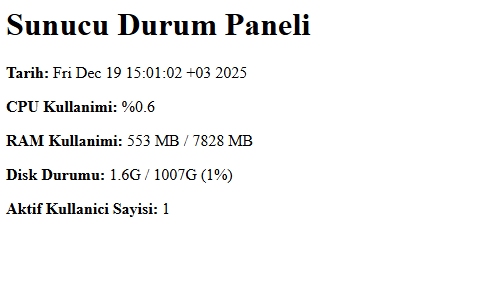

# Linux Sunucu Durum Paneli (Server Dashboard)

Bu proje, **Bilişim Sistemleri Altyapı ve Teknolojileri** dersi dönem projesi kapsamında
hazırlanmıştır.

Projenin amacı; Linux kabuk komutlarını kullanarak sunucu kaynaklarını (CPU, RAM, Disk,
aktif kullanıcılar) izlemek ve bu bilgileri **web tabanlı bir dashboard** üzerinden
göstermektir.

---

## Proje Özeti

- Linux ortamı olarak **WSL (Ubuntu)** kullanılmıştır.
- Sunucu durumu bilgileri **Bash script** ile alınmıştır.
- Çıktılar **HTML formatında** oluşturulmuştur.
- Web sunucusu olarak **Nginx** kullanılmıştır.
- Script, **cron** ile her dakika otomatik çalışacak şekilde ayarlanmıştır.

---

## Kullanılan Teknolojiler

- Ubuntu (WSL)
- Bash Script
- Nginx Web Server
- Cron (Zamanlanmış Görevler)

---

## Proje Dosyaları

- `monitor.sh` → Sunucu bilgilerini alıp HTML sayfası oluşturan script
- `README.md` → Proje açıklama dosyası
- `screenshot.png` → Dashboard ekran görüntüsü

---

## Kurulum ve Çalıştırma

### Nginx Kurulumu

```bash
sudo apt update
sudo apt install nginx -y
```
---

## Ekran Görüntüsü



